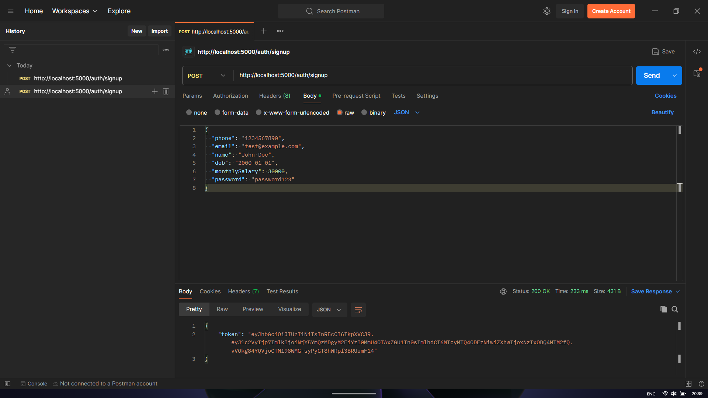
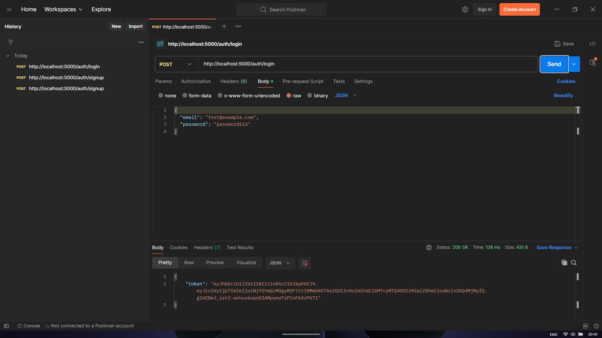
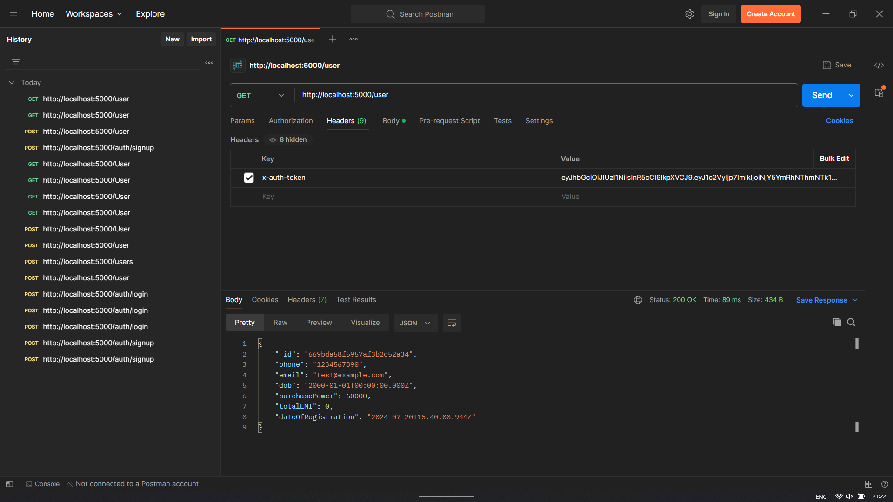
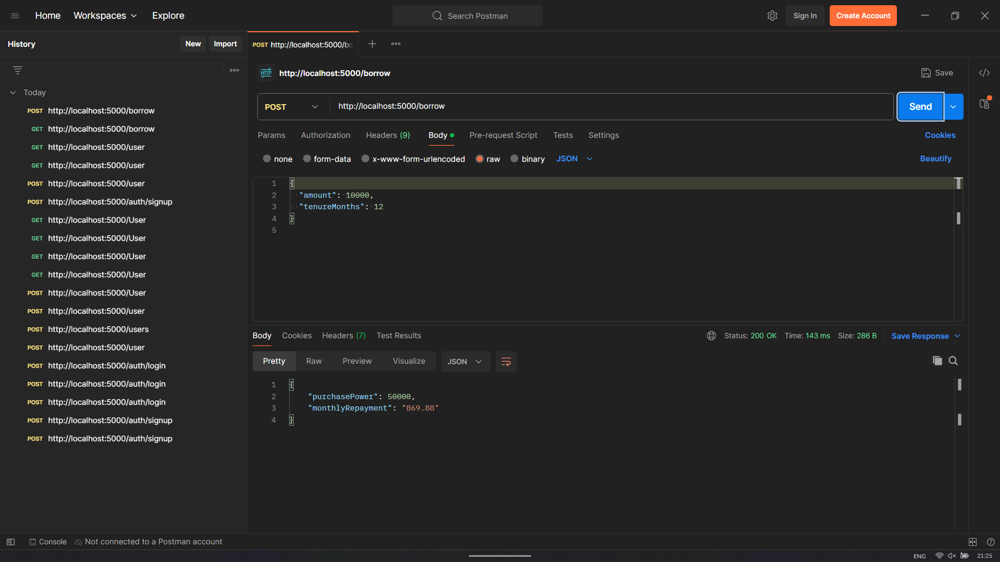
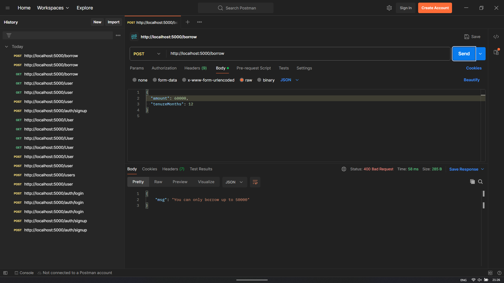
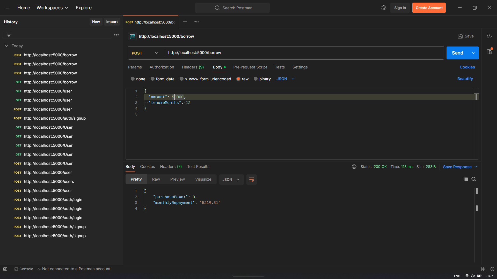
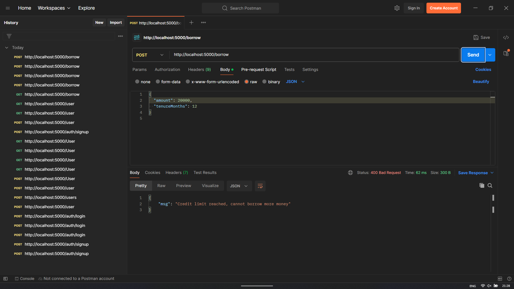

# Money Lending Application

This project is a backend implementation for a money lending application similar to apps like Slice and KreditBee. It provides APIs for user registration, login, fetching user data, and borrowing money, using Node.js, Express, MongoDB, and JWT for authentication.

## Table of Contents

- [Installation](#installation)
- [Usage](#usage)
- [API Endpoints](#api-endpoints)
  - [Signup](#signup)
  - [Login](#login)
  - [Get User Data](#get-user-data)
  - [Borrow Money](#borrow-money)
- [Environment Variables](#environment-variables)
- [Project Structure](#project-structure)
- [Screenshots](#screenshots)
- [License](#license)

## Installation

1. Clone the repository:
   ```bash
   git clone https://github.com/yourusername/money-lending-app.git
   cd money-lending-app
   ```

2. Install the dependencies:
   ```bash
   npm install
   ```

3. Set up environment variables in a `.env` file (see [Environment Variables](#environment-variables)).

4. Start the server:
   ```bash
   node app.js
   ```

## Usage

### Environment Variables

Create a `.env` file in the root directory with the following variables:
```env
MONGODB_URI=your_mongodb_atlas_connection_string
JWT_SECRET=your_jwt_secret
```

### API Endpoints

#### Signup

- **Endpoint**: `POST /signup`
- **Description**: Register a new user after verifying age and monthly salary.
- **Body Parameters**:
  ```json
  {
    "phone": "1234567890",
    "email": "test@example.com",
    "name": "John Doe",
    "dob": "2000-01-01",
    "monthlySalary": 30000,
    "password": "password123"
  }
  ```
- **Validation Criteria**:
  - User should be above 20 years of age.
  - Monthly salary should be 25k or more.

#### Login

- **Endpoint**: `POST /login`
- **Description**: Authenticate a user and get a JWT token.
- **Body Parameters**:
  ```json
  {
    "email": "test@example.com",
    "password": "password123"
  }
  ```

#### Get User Data

- **Endpoint**: `GET /user`
- **Description**: Retrieve user data.
- **Headers**:
  ```json
  {
    "x-auth-token": "JWT_TOKEN_HERE"
  }
  ```

#### Borrow Money

- **Endpoint**: `POST /borrow`
- **Description**: Borrow money from the application, update the Purchase Power amount, and calculate repayment details.
- **Headers**:
  ```json
  {
    "x-auth-token": "JWT_TOKEN_HERE"
  }
  ```
- **Body Parameters**:
  ```json
  {
    "amount": 10000,
    "tenureMonths": 12
  }
  ```

## Project Structure

```
money-lending-app/
│
├── config/
│   └── db.js           # Database connection configuration
│
├── models/
│   └── User.js         # User model
│
├── routes/
│   ├── auth.js         # Authentication routes (signup, login)
│   ├── user.js         # User data route
│   └── borrow.js       # Borrow money route
│
├── .env                # Environment variables file
├── app.js              # Main application file
├── package.json        # NPM package file
└── README.md           # Project README file
```

## Screenshots

Attach screenshots of the results obtained from hitting the API endpoints here.

1. **Signup Endpoint**
   

2. **Login Endpoint**
   

3. **Get User Data Endpoint**
   

4. **Borrow Money Endpoint**
   
   
   
   
